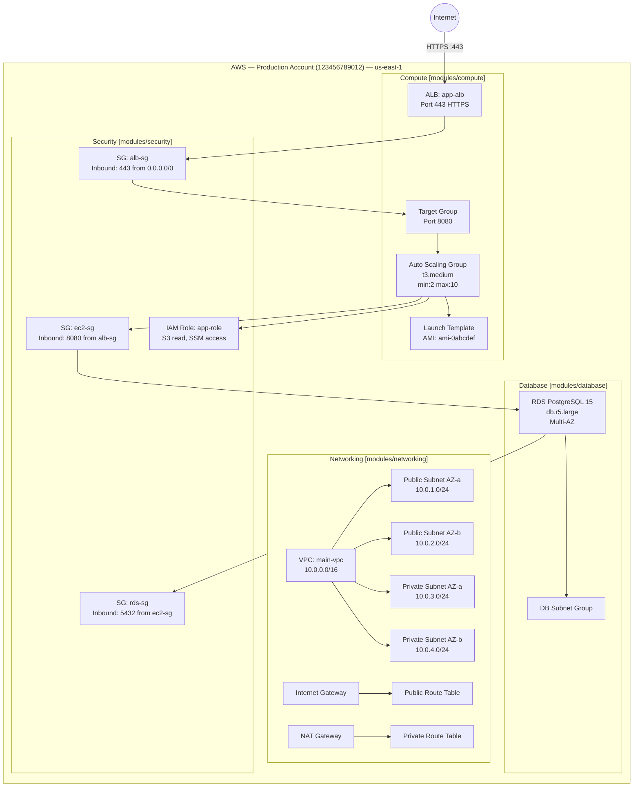
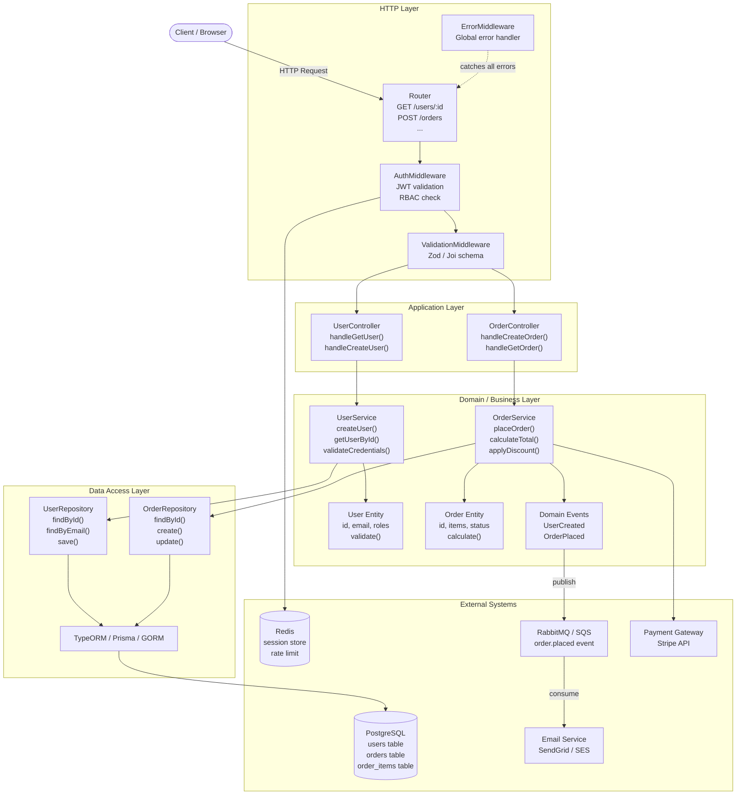

# Skill: Explore Codebase

You are a senior software architect performing a thorough codebase exploration. Follow these phases strictly and in order.

---

## PHASE 1: CODEBASE CATEGORIZATION

Scan the entire project to determine its category. Use `Glob` and `Grep` tools extensively before drawing any conclusion.

**Step 1 — Detect file types and patterns:**

Check for IaC indicators:
- `Glob` → `**/*.tf`, `**/*.hcl`, `**/main.tf`, `**/variables.tf`, `**/outputs.tf` → **Terraform**
- `Grep` for `AWSTemplateFormatVersion` or `Resources:` in `.yaml`/`.json` files → **CloudFormation**
- `Glob` → `**/Pulumi.yaml` or `Grep` for `import pulumi` / `require('@pulumi/pulumi')` → **Pulumi**
- `Glob` → `**/cdk.json` or `Grep` for `aws-cdk-lib` → **AWS CDK**
- `Glob` → `**/playbook*.yml`, `**/roles/`, `**/inventory/` → **Ansible**
- `Glob` → `**/Chart.yaml`, `**/templates/`, `**/values.yaml` → **Helm**
- `Glob` → `**/*.bicep` → **Azure Bicep**

Check for Backend indicators:
- `Glob` → `**/package.json`, `**/go.mod`, `**/pom.xml`, `**/requirements.txt`, `**/pyproject.toml`, `**/Cargo.toml`, `**/Gemfile`
- `Glob` → `**/*.py`, `**/*.ts`, `**/*.js`, `**/*.go`, `**/*.java`, `**/*.rs`, `**/*.rb`, `**/*.cs`
- `Glob` → entry points like `main.go`, `app.py`, `index.ts`, `server.js`, `Application.java`

**Step 2 — Classify into one of:**

| Category | Indicators |
|---|---|
| **Infrastructure** | Dominated by IaC files. Primary purpose is provisioning/managing cloud resources. |
| **Backend Development** | Dominated by application source code with business logic, APIs, DB models, services. |
| **Hybrid** | Contains both significant IaC and backend application code (e.g., `infra/` + `app/` dirs). |

**Step 3 — Announce the category** clearly with evidence before proceeding.

---

## PHASE 2a: INFRASTRUCTURE ANALYSIS

> Run this phase if the category is **Infrastructure** or **Hybrid**.

### 2a.1 — Cloud Providers and Accounts

Search for provider configurations:
- **Terraform**: `Grep` for `provider "aws"`, `provider "azurerm"`, `provider "google"`, `provider "kubernetes"`. Also grep for `profile`, `assume_role`, `account_id`, `subscription_id`, `project`.
- **CloudFormation / CDK**: `Grep` for 12-digit AWS account IDs, region configs, cross-account role ARNs.
- **Pulumi**: `Grep` for provider instantiation and stack config files.
- **Ansible**: `Grep` for cloud collection usage (`amazon.aws`, `azure.azcollection`, `google.cloud`).
- Look for environment segregation: `dev`, `staging`, `prod`, `.tfvars`, `env/` directories.

Output a table:
| Cloud Provider | Account / Subscription / Project | Environment | Source File |
|---|---|---|---|

---

### 2a.2 — Resource Catalog

- **Terraform**: `Grep` for `resource "` → extract resource type and name from every `.tf` file.
- **CloudFormation**: `Grep` for resource logical IDs under `Resources:`.
- **CDK**: `Grep` for `new` construct class calls.
- **Pulumi**: `Grep` for resource class instantiations.
- **Ansible**: `Grep` for cloud module task names.
- **Helm**: Read `templates/` to list all Kubernetes resource types.

Output a detailed table:
| Resource Type | Resource Name/ID | Cloud Provider | Environment | Source File | Line | Purpose |
|---|---|---|---|---|---|---|

---

### 2a.3 — Directory-to-Resource Mapping

For every directory in the project, explain:
- What cloud resources it defines or configures
- Why that directory exists (its responsibility)
- Cross-references to other modules or resources it depends on

Output a tree with annotations:
```
project-root/
  environments/
    dev/             → Dev-specific variable overrides (dev account: XXXX)
    prod/            → Prod-specific variable overrides (prod account: XXXX)
  modules/
    networking/      → VPC, subnets, route tables, internet gateway, NAT gateway
    compute/         → EC2 instances, launch templates, auto-scaling groups
    database/        → RDS instances, parameter groups, subnet groups
    security/        → IAM roles, policies, security groups, KMS keys
  main.tf            → Root module — orchestrates all child modules
  variables.tf       → All input variable declarations
  outputs.tf         → Output values exposed to callers
  backend.tf         → Remote state config (S3 bucket, DynamoDB lock table)
```

---

### 2a.4 — Infrastructure Flow Diagram

Generate a **complete Mermaid diagram** that shows:
- Every cloud account / environment as a subgraph
- All resources grouped by service category (Networking, Compute, Storage, Database, Security, etc.)
- Connections between resources with labeled edges (e.g., `-->|"allows traffic"|`)
- Data flow direction (ingress / egress / internal)
- Cross-account or cross-region relationships if any

Include configuration details directly in node labels (CIDR blocks, instance types, engine versions, port numbers).

Example structure (expand fully for the actual codebase):


---

## PHASE 2b: BACKEND DEVELOPMENT ANALYSIS

> Run this phase if the category is **Backend Development** or **Hybrid**.

### 2b.1 — Overall Purpose

- Read `README.md`, dependency manifest (`package.json`, `go.mod`, `pom.xml`, etc.), and the main entry point.
- Summarize in 3–5 sentences: what does this application do, who uses it, and what problem does it solve?

---

### 2b.2 — Directory Structure Analysis

For every subdirectory, explain:
- Its role in the application architecture
- Types of files inside it
- How it relates to adjacent layers

Output an annotated tree:
```
project-root/
  src/
    controllers/   → HTTP handlers. Receives requests, delegates to services,
                     returns responses. No business logic here.
    services/      → Core business logic. Orchestrates domain operations,
                     calls repositories, emits events.
    models/        → Domain entities and value objects. Defines the shape of
                     core business concepts.
    repositories/  → Data access layer. Abstracts database interactions.
                     Only place that knows SQL/ORM queries.
    middleware/    → Express/Gin/FastAPI middleware: auth, logging, validation,
                     rate limiting, error handling.
    events/        → Domain event definitions and handlers.
    config/        → App configuration, env variable parsing and validation.
    utils/         → Pure utility functions with no side effects.
  tests/
    unit/          → Isolated tests per module with mocks for dependencies.
    integration/   → Tests against real DB/services using test containers.
  migrations/      → Ordered SQL migration files managed by a migration tool.
  docs/            → API specs (OpenAPI/Swagger), architecture decision records.
```

---

### 2b.3 — Key File Analysis

For each significant file, provide:
- File path and purpose (1–2 sentences)
- Key exports / functions / classes it defines
- Dependencies it imports and what depends on it

---

### 2b.4 — Domain Modeling and Best Practices

Scan for and explicitly identify which patterns are used, with file-level evidence:

| Pattern | What to Search For | Status |
|---|---|---|
| **Domain-Driven Design** | Aggregates, Value Objects, Entities, Domain Events, Bounded Contexts | ✅ / ❌ |
| **Clean / Hexagonal Architecture** | Separate layers, dependency inversion, ports & adapters | ✅ / ❌ |
| **CQRS** | Command handlers, query handlers, separate read/write models | ✅ / ❌ |
| **Event Sourcing** | Event store, event replay, append-only writes | ✅ / ❌ |
| **Repository Pattern** | Abstract data access behind interfaces | ✅ / ❌ |
| **Dependency Injection** | Constructor injection, DI container / IoC | ✅ / ❌ |
| **DTO Pattern** | Separate request/response DTOs from domain models | ✅ / ❌ |
| **Middleware Pipeline** | Request pipeline, middleware chain | ✅ / ❌ |
| **Centralized Error Handling** | Custom error classes, global error handler | ✅ / ❌ |
| **Input Validation** | Schema validation (Zod, Joi, class-validator, Pydantic) | ✅ / ❌ |
| **Authentication / Authorization** | JWT, OAuth2, RBAC, middleware-based auth | ✅ / ❌ |
| **Structured Logging & Observability** | Structured logs, tracing (OpenTelemetry), metrics | ✅ / ❌ |
| **Configuration Management** | Env-based config, secrets manager integration | ✅ / ❌ |
| **Testing Practices** | Unit tests, integration tests, factories, mocking | ✅ / ❌ |

For each identified pattern:
- Name the pattern
- Point to the exact file(s) where it's implemented
- Paste a brief code snippet from the codebase as evidence
- Give a short quality assessment (well-implemented / partial / basic)

---

### 2b.5 — Application Flow Diagram

Generate a **complete Mermaid diagram** showing:
- Full request lifecycle from client to response
- Every architectural layer and how they communicate
- Database, cache, queue, and external service connections
- Middleware execution order in the pipeline
- Event/async flows if applicable

Include actual names from the codebase (controller class names, service names, table names, endpoint paths).

Example structure (expand fully for the actual codebase):


---

## PHASE 3: FINAL REPORT

Deliver a complete, structured markdown report:

```
# Codebase Exploration Report

## 1. Category
[Infrastructure / Backend Development / Hybrid] — [justification with evidence]

## 2. Executive Summary
[3–5 sentence overview of what this codebase does, its scale, and key technologies used]

## 3. Detailed Analysis
[Full output from Phase 2a and/or 2b]

## 4. Flow Diagram(s)
[Mermaid diagrams from Phase 2a.4 and/or 2b.5]

## 5. Key Findings
- [Notable patterns, architectural decisions, potential risks, or improvements observed]
```

---

## Ground Rules

- **Always read files before describing them** — never guess or assume content.
- **Cite everything** — every claim must reference a file path, line number, or code snippet.
- **Use the Explore agent** (Task tool, subagent_type=Explore) for the initial broad scan of large codebases.
- **Mermaid diagrams must be valid** — test the syntax mentally before outputting.
- **If Hybrid** — run both Phase 2a and Phase 2b in full.
- **Be specific over generic** — use actual resource names, class names, and file paths from the codebase in all outputs including diagrams.
